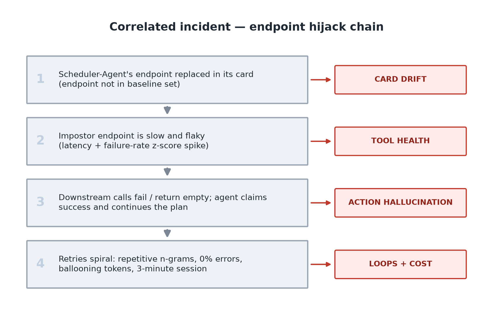
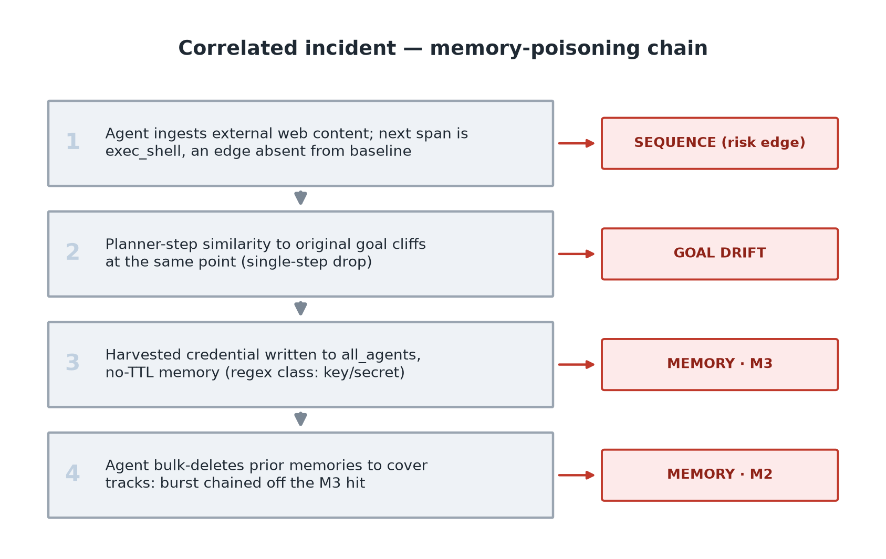

# Agent Behavioral Analytics — Planning Reference

The plan: synthesize a month of enterprise agent logs, plant known attack and
failure patterns in the tail end, and run everything through one funnel.
Generate the data, learn "normal" from the clean window, run rule and
statistical triggers over the rest, rank whatever they flag, and grade against
the labels the injectors left behind.

Deliverable: an insider-agent-threat detection demo on a toy dataset small
enough that every planted incident is findable by eye and tells a story.


---

## 1. Unified event schema (the backbone)

One JSONL trace/span stream that all detectors consume, loosely modeled on the
OpenTelemetry GenAI semantic conventions:

```json
{"trace_id": "...", "span_id": "...", "parent_span_id": "...",
 "ts": "2026-06-22T14:03:11Z", "session_id": "...", "agent_id": "agent-triage-01",
 "user_id": "alice", "tenant": "acme-corp",
 "event_type": "llm_call | tool_call | tool_result | delegation | goal_established | planner_step | memory_op | final_response",
 "tool": "create_ticket", "args_hash": "ab12...",
 "status": "ok | error | timeout | empty",
 "latency_ms": 812, "tokens_in": 1420, "tokens_out": 96,
 "records_returned": 0,
 "content": "...", "claimed_actions": ["create_ticket"],
 "injected_scenario": null}
```

`memory_op` events carry an additional block:

```json
{"event_type": "memory_op",
 "memory": {"memory_id": "...", "op": "create | read | update | delete",
            "owner": "alice", "tenant": "acme-corp",
            "retriever": "bob", "initiator": "agent | system_gc",
            "ttl_days": 30, "audience": "user | workspace | all_agents",
            "old_value_hash": "...", "new_value_hash": "...",
            "content": "..."}}
```

Goal and planner events: `goal_established` carries the original user goal
text; `planner_step` carries the planner's one-sentence step summary and,
where applicable, its tool justification. These are the only free-text fields
the goal-drift detector embeds. Never chain-of-thought, never tool names.

Design notes, and why each field exists:

- `injected_scenario` is the ground-truth label, so every detector can report
  precision and recall (same role as the `injected` column in drift.py).
- `parent_span_id` chains give delegation depth for free.
- `status: "empty"` and `records_returned` exist specifically so the action
  hallucination detector can tell "errored" apart from "succeeded but found
  nothing."
- `args_hash` makes repetition cheap to detect without parsing arguments.
- `user_id` and `tenant` live at the top level because the cross-user memory
  invariant needs them on the session, not just inside memory ops.
- There is no shared sensitivity registry. Sensitivity is derived where it is
  observed: DLP regex classes carry severity for memory content (§3.3 M3),
  and high-risk behavior is derived from per-tool taint tags inside the
  sequence detector (§3.4). Tool metadata, not an enumerated edge list or an
  ontology. In production the equivalent metadata comes from governance
  sources you already have (data-classification tags, IAM policy
  annotations); a detection repo consumes that metadata, it doesn't mint it.

## 2. Repo structure

```
agent-behavioral-analytics/
├── README.md
├── PLANNING.md
├── pyproject.toml                 # optional extra: [embed] pulls sentence-transformers
├── .gitignore                     # venv/, *.csv outputs, __pycache__, model cache
├── aiba/
│   ├── schema.py                  # event + agent-card dataclasses
│   ├── embed.py                   # optional: pinned model load, cache, cosine utils, .npz IO
│   ├── synth/
│   │   ├── traffic.py             # benign multi-agent traffic generator
│   │   └── scenarios.py           # one injector per attack (like inject_* fns)
│   ├── detectors/
│   │   ├── base.py                # Detector interface: events in, ranked findings out
│   │   ├── action_hallucination.py
│   │   ├── loops.py
│   │   ├── memory.py              # cross-tenant, deletion anomalies, DLP-on-write
│   │   ├── sequence.py            # Markov/edge-frequency + taint-derived high-risk edges
│   │   ├── goal_drift.py          # optional, requires [embed]: cliff + slow-slide tests
│   │   ├── tool_health.py
│   │   ├── cost.py
│   │   └── card_drift.py          # refactored + rug-pull rule (requires [embed])
│   └── report.py                  # merged ranked findings + cross-detector correlation
├── data/sample/
│   ├── events.jsonl               # committed sample dataset
│   ├── agent_cards.jsonl
│   └── embeddings.npz             # precomputed embeddings for sample data
└── scripts/run_all.py             # generate, detect, report — one command
```

Housekeeping during the refactor:

- `git init` plus a `.gitignore` (there is a committed `venv/` in the current
  folder, which is exactly the kind of thing `.gitignore` exists to prevent).
- Keep the rule-based core deterministic (seeded RNG, no API keys) so the
  repo runs offline and results reproduce.

### 2.1 Embedding infrastructure & reproducibility policy

- Model: `BAAI/bge-small-en-v1.5`, revision pinned in `embed.py`. About 130MB
  downloaded once from HuggingFace, fully offline afterward; under 5ms per
  embedding on Apple Silicon or a modern CPU.
- Optional extra: `pip install .[embed]`. Every rule-based detector runs
  without it; `goal_drift` and the rug-pull/shadowing-upgrade rules need it.
- `embeddings.npz` is committed for `data/sample/`, so anyone who clones gets
  bit-exact eval reproduction without downloading the model. Regenerating
  from scratch tolerates small float variance; thresholds are set with
  margin, never at the third decimal.
- Embed descriptions and goal/planner text, never tool names. Names are
  arbitrary identifiers (`fetch_hr_recs` means nothing to an embedding
  model); descriptions carry the semantics.
- Budget: goal, planner summaries, tool justifications, final answer.
  Typically under 10 embeddings per session.

---

## 3. Detectors

### 3.1 Action hallucination

Definition: the agent claims a task outcome that the execution log does not
support.

Reconcile `final_response.claimed_actions` against `tool_call` and
`tool_result` events within the same trace.

Injected scenarios (the theme is "read failure, kept trekking"):

1. Errored-but-claimed: a tool call returns `status=error` (or `timeout`);
   the agent's final response claims success, and the trace shows it
   continued the plan as if the step had worked, with dependent tool calls
   proceeding normally.
2. Empty-but-claimed: a tool returns `status=empty` / `records_returned=0`
   (a query that legitimately matched nothing); the agent reports "found and
   processed N records" and keeps going, downstream steps operating on data
   that does not exist.

Both share the signature: a failed or empty upstream result, followed by
uninterrupted downstream execution and a success claim. The detector should
flag the contradiction pair (the bad tool_result span plus the claiming
final_response span), not just the claim.

Detection rules:

- R1: `claimed_actions` contains tool T, but no `tool_call` for T exists in
  the trace. Flag: a claim about a call that never happened.
- R2: `tool_call` for T exists but the latest `tool_result` has `status` in
  {error, timeout}. Flag: errored-but-claimed.
- R3: the `tool_result` has `status=empty` / `records_returned=0` but the
  claim implies data was produced or processed. Flag: empty-but-claimed.
- Toy-data simplification: claims arrive semi-structured (the
  `claimed_actions` field), so detection stays deterministic. Real-world
  claim extraction from free text is an NLP/LLM-judge problem. That is the
  honest gap here.

### 3.2 Loops / runaway recursion

The definitive runaway-loop signature is a combination, never one signal:
high token consumption, roughly 0% error rate, and highly repetitive
sequences within a single session. A loop that errors gets killed; the loop
where every step reports healthy is the one that runs all night.

Detection features per session/trace:

1. Repetitive n-grams: slide a window of n consecutive `(tool, args_hash)`
   steps (n = 2 to 4) and compute how dominant the top n-gram is
   (`count(top_ngram) / total_steps`). Benign work has diverse n-grams; a
   loop is one n-gram winning the whole session.
2. Delegation depth: walk the `parent_span_id` chains and flag depth past a
   baseline-derived threshold (the 99th percentile of benign depth, i.e.
   deeper than 99% of everything seen in the clean window).
3. Delegation cycles, with baselining: build per-agent-pair cycle profiles
   from the clean window. If A hands to B and B hands back to A as
   business-as-usual (scheduler and worker, say), that alone is not flagged.
   Flag cycles that are novel versus baseline, or baseline-normal in shape
   but repeated an anomalous number of times within one session.
4. Token spikes: a single session consuming thousands of unexpected tokens
   versus that agent's own per-session baseline. Scored as a z-score, which
   is just "how many standard deviations above this agent's normal" (same
   mechanic as drift.py's capability z-score).
5. Abnormal duration / span count: benign tasks finish in roughly 1 to 5
   seconds with a handful of spans. Flag sessions stretching past a minute
   with hundreds of micro-steps. Thresholds come from baseline percentiles,
   not hardcoding, though the synthetic data is tuned so these round numbers
   hold.
6. Suspiciously clean health: a 0% error rate over a prolonged, high-step
   session. Perfect health plus prolonged execution plus repetition equals
   runaway loop.

Scoring: additive risk, like drift.py. No single feature flags alone;
repetition plus token spike plus long duration plus clean health stack to a
high-risk finding. This keeps false positives down on legitimately long batch
jobs, which tend to have some errors and retries and diverse n-grams.

Injected scenarios:

- Retry spiral: fetch, summarize, fetch, summarize, hundreds of times, all
  `status=ok`, ballooning tokens, three-minute session.
- Deep delegation: a chain of handoffs well past baseline depth.
- Off-baseline cycle: two agents that never interact in baseline suddenly
  ping-pong within one session.
- Control (must not flag): a baseline-normal scheduler/worker handoff at
  normal volume, present in the eval window to prove the baseliner
  suppresses it.

### 3.3 Memory

Framing: persistent memory is an endpoint registry / database, so treat every
memory operation as an audited write. Three rule families, one detector, all
consuming `memory_op` events.

**M1 — cross-user / cross-tenant retrieval.** An invariant, not an anomaly:

- `memory.owner != user_id` on a read: flag.
- `memory.tenant != tenant` on a read: flag, higher severity.
- No baseline needed, and false positives are zero by construction. This is
  the highest-impact enterprise detection in the set and the cleanest
  injected scenario: Alice's memory shows up in Bob's retrieval results,
  findable by eye in the JSONL.

**M2 — deletion anomalies.** Every rule here is scoped to `initiator=agent`,
and the scoping is the whole trick. System GC (LRU eviction, TTL expiry, FIFO
cycling) deletes old, cold memories as routine hygiene; an unscoped age- or
burst-based rule would page you every time the garbage collector runs.
Agent-initiated deletion is a decision, and decisions are the signal surface.

- First-ever deletion: the agent has zero agent-initiated deletes in the
  baseline window, then deletes something. Reliable precisely because benign
  agents almost never delete, unlike generic "first time using a tool"
  signals, which fire constantly.
- Deletion burst after suspicious context, i.e. the anti-forensics
  signature: at least K agent-initiated deletions within N events of an
  `error` status in the same session, a finding from any other detector on
  that session or agent, or an M3 DLP hit. Chaining off M3 makes the pattern
  causally explicit: write a secret, then erase the history. Attackers
  destroy evidence; benign agents almost never bulk-delete.
- Old-and-hot deletion: an agent deletes a memory that is both long-standing
  (older than the baseline 95th percentile) and recently read (a read within
  a recency window, computed from the event stream, no new field needed).
  Age alone is FIFO/LRU bait, since eviction targets old cold memories.
  Deleting an old memory that was in active use is destroying a record
  someone still relied on.

**M3 — sensitive-data persistence (DLP-on-write).** DLP is data loss
prevention: pattern-matching content for things that shouldn't be there.

- Regex classifiers over `memory.content` on `create`/`update`: AWS key
  prefixes (`AKIA...`), `-----BEGIN ... PRIVATE KEY`, JWT structure
  (`eyJ...`), SSN format, obvious `password=` / `api_key=` assignments.
  These patterns are genuinely high-precision in the real world, not just in
  toys.
- Severity comes from the regex class itself (credentials and keys above
  PII, PII above generic markers). Sensitivity is a property of the content,
  observed at write time; no tool ontology required.
- Additive risk score: severity × TTL × audience. An SSN stored forever and
  visible to all agents pages immediately; a favorite color with a 30-day
  TTL scores roughly zero.

Injected scenarios: a cross-tenant retrieval (M1); a deletion burst following
a DLP-flagged credential write (M2, chained off M3); an agent deleting an
old, frequently-read memory (M2 old-and-hot); a plaintext AWS key written to
an `all_agents` memory with no TTL (M3). Controls that must not flag: a
`system_gc` sweep deleting a batch of old cold memories, correctly ignored,
which is the cleanest demo that the initiator and temperature scoping earn
their keep; a benign deletion by an agent with baseline deletion history; and
normal TTL'd low-sensitivity writes.

### 3.4 Sequence / rare edges

Complements loops without overlapping: loops catches repetition of the same
edge, this catches edges that shouldn't exist at all. Markov/edge-frequency,
which is a fancy way of saying "count which tool tends to follow which tool,
and be suspicious of transitions you've never counted." Deliberately not
transformers: constant memory, explainable, deterministic under a seed.

Detection:

- Build per-agent edge counts, `P(next tool | current tool)`, from the clean
  baseline window. Score session edges by rarity: below a probability floor,
  or never seen at all. Rarity alone contributes score but does not page,
  because novel-but-innocuous edges happen in benign traffic all the time.
- Taint-derived high-risk edges flag regardless of baseline frequency.
  "Taint" is borrowed from program analysis: mark data from untrusted
  sources as dirty and watch where it flows. This is NOT an enumerated list
  of bad `(current, next)` pairs; that would be circular, scoring
  hand-written edges against hand-authored attacks that traverse exactly
  those edges. Instead each tool carries taint tags: a source class (does it
  ingest untrusted, external content?) and a sink class (does it execute,
  exfiltrate, or touch secrets or identity?). A high-risk edge is derived:
  untrusted source followed by privileged sink. So web-content read followed
  by shell execution (the classic indirect-prompt-injection tell, OWASP
  LLM01) fires, and so does any untrusted-to-privileged transition,
  including pairs nobody enumerated, like `read_web` then `grant_admin`. The
  tags are the toy stand-in for governance metadata (data classification,
  IAM annotations on each tool); in production a detection repo consumes
  that metadata, it doesn't mint it.
- This is the bridge to indirect prompt injection. We detect the behavioral
  symptom (untrusted content ingested, then an out-of-contract action) via
  taint and dataflow, without simulating the injection mechanism or
  classifying content.

  A note on circularity, since it matters: deriving risk from tool tags
  rather than listing known-bad edges is the honest fix for the critique
  that a signature list scored against author-injected attacks measures
  string-matching, not detection. The learned half, the Markov rarity layer,
  is the non-circular part, and the benign-but-rare control below exists to
  exercise it.

Injected scenarios: a web fetch returns instruction-laden content and the
next span is `exec_shell`, never seen in baseline for that agent; a rare
`read_docs` then `delete_records` edge. Control: a rare-but-benign edge
between two innocuous tools, which accrues rarity score but stays under the
alert threshold, demonstrating that rarity without a risk hit or
corroboration doesn't page.

### 3.5 Goal drift (requires `[embed]`)

What it embeds: the original goal (`goal_established`), planner step
summaries and tool justifications (`planner_step`), and the final answer.
Under 10 embeddings per session. Never tool names, never chain-of-thought.

Detection works on the shape of the similarity curve, not an absolute cutoff.
An absolute threshold like `cosine < 0.75` never generalizes; what does
generalize is watching the similarity-to-goal time series per session and
flagging on:

- The cliff: a large single-step drop, similarity 0.95 on one step and 0.61
  on the next. One planner step suddenly has nothing to do with the goal.
- The slow slide: a sustained decline where no step ever recovers toward the
  goal, and the total end-to-end drift exceeds a baseline-derived bound.
  This is the gradual mutation that never makes one sudden move, and it is
  worth flagging in its own right because benign topic-broadening always
  recovers at least once. A benign researcher wanders and comes back; a
  compromised plan wanders and keeps walking.
- A per-agent z-score on session-mean similarity (same mechanic as
  drift.py).

Injected scenario: a "summarize Q2 earnings" session whose planner steps
mutate through searching filings, extracting revenue, opening a mailbox,
collecting credentials, exfiltrating. Deliberately a gradual slide, not a
cliff: no single step drops far enough to trip the cliff rule, so the
monotone-slide rule has to catch it (sustained decline, zero recoveries).
Control: a benign multi-step session with naturally decreasing but smooth
similarity, a research task that legitimately broadens. It recovers, so it is
not monotone, so no flag.

Limitation: on synthetic data this eval is partially circular. I authored
both the goals and the drifted plans, so the similarity separation is partly
my own authorship being measured back at me. Same caveat class as action
hallucination's claim extraction. The method is included because it is the
production-realistic technique, and the cliff-versus-slide design is the part
that transfers.

### 3.6 Tool health (latency + fail rates)

Per-tool baselines from the clean window: latency distribution, failure rate.
The security framing: a latency or failure spike can be the symptom of an
endpoint hijack, which makes this detector the bridge between card drift's
endpoint-change flag and the downstream findings in the correlated incident.

The latency test is robust, not a z-score, and the data forced this. Real
telemetry is heavy-tailed, and a mean/std z-score false-positives on ordinary
long-tail calls; in the heterogeneous benign traffic here, perfectly normal
slow calls reach z>13. So a latency spike is defined as max latency above 4×
the tool's own p99 baseline (p99 meaning the level 99% of benign calls stay
under). The hijacked endpoint sits around 6× p99 while benign tails stay
under about 3×. This is the robust-statistics fix described in §5.1.

Signal weighting: the latency spike is the standalone-worthy trigger. The
failure-rate spike is corroboration only. It requires a minimum sample (one
failure out of two calls is not a "rate," it's a coin flip) and carries risk
below the emit floor, so on its own it cannot page. It earns its place by
stacking on the latency spike: slow AND flaky is the hijack signature.
Short-window rate noise was the entire source of this detector's false
positives; gating it this way took tool-health precision to 1.00 without
losing the hijack.

### 3.7 Cost per token

Static pricing table (per-model in/out token rates). Per-agent and per-trace
spend baselines; z-score anomalies. Intentionally overlaps with loop
detection: the injected loop should also be the top cost anomaly, which is
cheap, legible cross-detector corroboration.

### 3.8 Agent card drift

A2A-style card registrations scored against a learned baseline. Rules:
typosquat (name similarity plus a new id), shadowing (skill-set overlap plus
a new id), capability escalation (skill-count z-score), endpoint hijack
(endpoint not in the baseline set).

Structured skills. Cards carry A2A-style `AgentSkill` objects (`id`, `name`,
`description`, `tags`), not bare tool-name strings. The `id` is the invocable
identifier, so it doubles as the scope/authorization boundary below, and the
`tags` are governance metadata, a capability category. That enables a
sensitive-capability rule: a known agent gaining a NEW skill whose tags mark
a `privileged`/`identity`/`exfil` action fires on the capability category,
not the count. This catches a skill swap (count unchanged, z-score near zero)
that the count rule would sleep through. Reading tags is the non-circular
alternative to hand-listing bad skill names, mirroring the §3.4 taint
approach.

Capability/scope violation: cross-reference the event log against the agent
cards and flag any agent invoking a tool its card never declared. This turns
the card from a registry artifact into an authorization boundary, and doubles
as novel-tool detection: a tool observed in the logs that no card declares is
itself a finding.

Rug-pull rule (requires `[embed]`): name-close AND description-far. String
similarity (edit distance) says "this claims to be the same tool"; embedding
distance on the description says "but it now does something different." This
is the MCP tool-description rug-pull, implemented as a detector rule.

Division of labor, because each technique has a lane:

- Identity spoofing (typosquat): string metrics. Typosquats are designed to
  be semantically identical, embedding similarity around 0.99, so embeddings
  are exactly the wrong tool there.
- Semantic drift of goals and plans: embeddings (§3.5).
- Rug-pull: the intersection. String-close and embedding-far.

Shadowing upgrade (requires `[embed]`): plain Jaccard overlap on skill sets
misses paraphrased skill lists, so add embedding similarity on descriptions
to catch "same function, reworded."

---

## 4. Correlated incidents

### 4.1 Endpoint hijack chain

1. Scheduler-Agent's endpoint is hijacked; card drift flags the endpoint
   change.
2. The impostor endpoint is slow and flaky; tool health flags the latency
   and failure spike.
3. The downstream agent's calls fail or return empty; it claims success and
   keeps going; action hallucination flags errored-but-claimed.
4. Retries spiral into a repetitive session with a token bill; loops and
   cost both flag the same session.




### 4.2 Memory poisoning chain

1. The agent ingests external web content (context, not a detection), and
   the next span is shell execution, an edge absent from baseline; sequence
   flags the web-read-then-exec edge.
2. The agent writes a harvested credential to an `all_agents`, no-TTL
   memory; memory (M3 DLP) flags the write.
3. The agent bulk-deletes prior memories to cover its tracks; memory
   (M2 deletion burst) fires, chained off the M3 hit.



(This chain's goal-similarity series stays above the cliff bound and recovers
mid-session, so goal drift correctly does not fire here. The slow-slide
mutation it does catch is the standalone §3.5 goal-mutation scenario.)

Scope clarification: we detect the drift symptoms of memory poisoning, not
the poisoning mechanism itself. Mechanism simulation stays out of scope, and
content-level injection detection is future work (§5).

`report.py` correlates findings by trace, agent, and time, and reconstructs
both timelines. That is the payoff demo: it is why these signals belong in
one pipeline instead of eight separate dashboards.

---

## 5. Scope decisions

In scope: detection over logs only. Monitoring, not runtime enforcement or
blocking. The rule-based core is fully deterministic, offline, and seeded.
Embedding-based detectors are an optional extra with a pinned model and
committed sample embeddings (§2.1).

Adjacent topics to mention or lightly include:

- Indirect prompt injection via tool results (OWASP LLM01): behavioral
  symptom detection is covered by sequence.py's high-risk edges (§3.4);
  content-level detection is future work.
- Data exfiltration heuristics: oversized tool args, non-allowlisted
  domains.

Out of scope (future-work section only):

- Dynamic tool ontology. Novel-tool detection already exists as card drift's
  scope-violation rule (§3.8); the open pieces are automated triage of the
  novel tool (benign or suspicious?) and sensitivity assignment, which need
  an LLM judge plus human sign-off, or existing governance metadata, to be
  authoritative. Ontology-drift monitoring (tool descriptions changing over
  time) is the natural companion detector.
- Content-level prompt-injection / jailbreak classification (a moderation
  model, Llama Guard-style).
- Memory poisoning mechanism simulation, multi-agent trust and negotiation
  attacks, agent supply chain, LLM-as-judge claim extraction, runtime
  guardrails, dormant-permission UEBA (needs production-depth baselines),
  and an API-embedding / `--llm-judge` mode reusing the §3.5 curve-shape
  approach.

### 5.1 Learned baseline — Isolation Forest vs the rules (optional `[ml]`)

The question a reviewer will (and should) ask: would an unsupervised learner
do as well as the hand-built rules? `aiba/detectors/isoforest.py` answers
it head-on. It trains an Isolation Forest on one per-session behavioral
feature vector, the union of the scalars that loops, cost, tool_health,
memory, sequence, and action_hallucination already compute, using the
clean baseline window only. `scripts/eval_isoforest.py` does a proper
train/test split and sweeps the decision threshold into a precision/recall
curve (PR-curve PNG plus average precision).

The benign traffic is deliberately heterogeneous: per-tool heavy-tailed
latency, bursty tokens, per-agent "personalities" across 10 agents and 3
tenants. The normal envelope has to be a real multi-modal cloud rather than
one tight gaussian ball, otherwise the comparison is rigged in the rules'
favor.

Why PR and not ROC: roughly 17 attack sessions against roughly 300 benign
ones (prevalence around 0.05) is the imbalanced rare-event regime. ROC's
enormous false-positive-rate denominator flatters everything, so average
precision (PR-AUC) is the honest headline number.

Result (seed 42): a split decision. Complementary, not competing.

- On aggregate PR-AUC the rules win: rule suite AP around 0.83, isolation
  forest around 0.49, no-skill baseline around 0.05. Most attacks here are
  invariant violations (a cross-tenant read, a scope violation, a claimed
  action the log contradicts): booleans the rules encode exactly, and which
  barely perturb a 21-dimension behavioral vector. The learner cannot
  compete on those.
- But the learner owns the scenarios the rules are blind to. Two attacks
  (`low_and_slow_compromise`, `dense_burst_anomaly`) drift several
  behavioral dials to about 2.5× at once while keeping every single dial
  under its rule threshold. No rule pages (the suite scores 15/17), yet the
  joint displacement is a clean anomaly the forest flags. That is the whole
  point of running a learner alongside signatures.
- Enriching the benign envelope actually made the forest worse on the
  invariant attacks: more benign variety to hide among. Which is the honest
  lesson: messier data does not rescue a learner; matching the attack shape
  to the detector's strength does.
- Same-universe caveat: card-modality attacks (typosquat, shadowing,
  capability escalation, endpoint hijack, rug pull) have no event-stream
  session and are outside this detector's universe by construction; that is
  card_drift's beat. Purely semantic drift (goal_mutation, whose tool and
  token footprint is benign) is likewise invisible to a behavioral learner.
  That negative is intentional; it is exactly what the embedding rule in
  §3.5 exists to cover.

Takeaway: rules win on invariants, the learner wins on diffuse multivariate
drift, so you run both, and the interesting engineering is knowing which is
which. A side effect worth keeping: the heterogeneous latency broke
tool_health's naive mean/std z-score (benign long-tail calls hit z>13), which
forced the hardening to a multiple-of-p99 spike test. Realistic data exposing
a fragile threshold is itself part of the exercise. On synthetic data both
sides still inherit the §3.5 circularity caveat, so this is a methodology
demo (clean train/test split, PR-AUC, the split decision), not an external
efficacy claim.

References: OWASP Top 10 for LLM Apps, OWASP Agentic Security Initiative,
MITRE ATLAS, the A2A agent card spec, OpenTelemetry GenAI semantic
conventions.

---

## 6. Build order

1. `schema.py`: event and card dataclasses; the `memory_op`,
   `goal_established`, and `planner_step` event types.
2. `synth/traffic.py`: benign multi-agent traffic. The clean baseline stats
   are load-bearing: 1-5s sessions, diverse n-grams, occasional benign
   errors and retries, routine memory ops including rare benign agent
   deletions and routine `system_gc` eviction of old cold memories, and
   smooth goal-similarity sessions.
3. Refactor `card_drift.py` into the detector interface (proves the
   interface).
4. `action_hallucination.py` and `loops.py`, built alongside their
   injectors.
5. `memory.py` and `sequence.py`, built alongside their injectors. M2's
   burst rule consumes M3 hits, so build M3 first within the module.
6. `tool_health.py`, `cost.py`.
7. `embed.py`, `goal_drift.py`, and the rug-pull/shadowing-upgrade rules in
   card_drift; generate and commit `embeddings.npz`.
8. Correlated-incident injectors (both chains) plus `report.py`.
9. Commit `data/sample/`, write the README.
